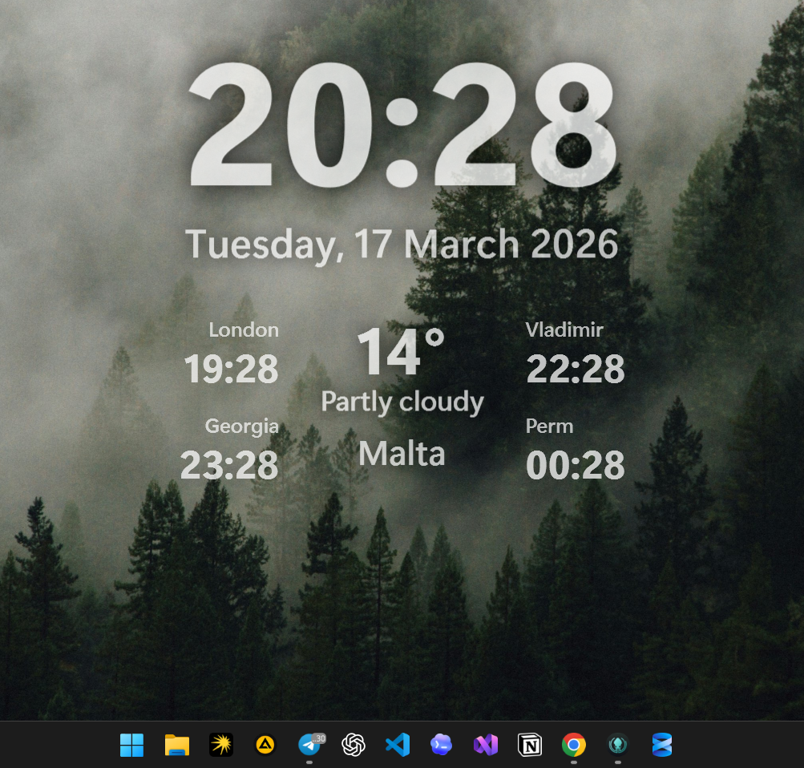

# TimeWidget

TimeWidget is a lightweight Windows desktop widget built with WPF. It shows the current time, date, and local weather in a clean always-visible overlay that can sit behind normal apps like part of the wallpaper.

## Example



## Features

- Large clock and date display
- Current weather for your location
- Wallpaper mode that stays behind normal windows
- Setup mode for dragging and positioning the widget
- System tray controls for setup, centering, and exit
- Saved widget position between launches
- Weather refresh and resume handling after sleep/wake

## Requirements

- Windows 10 version 2004 or newer, or Windows 11
- .NET 10 SDK
- Internet access for weather updates
- Windows location access enabled if you want automatic local weather

## Run

From the repository root:

```powershell
dotnet restore .\src\TimeWidget.csproj
dotnet run --project .\src\TimeWidget.csproj
```

You can also open `src/TimeWidget.csproj` in Visual Studio and run it as a normal desktop application.

## How It Works

When the app starts, it opens as a borderless transparent widget and also creates a tray icon.

- `Show for setup` brings the widget to the front so you can drag it
- `Back to wallpaper` returns it to non-interactive wallpaper mode
- `Center widget` places it in the middle of the primary display
- `Esc` exits setup mode and sends it back behind other windows

The widget updates:

- Time every second
- Weather every 15 minutes

## Weather And Location

TimeWidget asks Windows for your current location and then loads weather data from [Open-Meteo](https://open-meteo.com/).

- If location access is allowed, weather is fetched automatically for the detected coordinates
- If location access is blocked, the widget shows `Enable Windows location`
- If the weather request fails, the widget shows `Weather unavailable`

Fallback coordinates are currently disabled by default. If you want the widget to use a fixed location when Windows location is unavailable, edit the constants in `src/Infrastructure/WindowsLocationService.cs`.

## Saved Settings

The widget stores its last position here:

```text
%LocalAppData%\TimeWidget\widget-settings.json
```

This file is written on a best-effort basis when the widget position changes or the app closes.

## Project Structure

```text
src/
|-- Abstractions/
|-- Infrastructure/
|-- Models/
|-- ViewModels/
`-- Views/
```
